#  Delivery Checklist — Day 12 Lab Submission

> **Student Name:** _________________________  
> **Student ID:** _________________________  
> **Date:** _________________________

---

##  Submission Requirements

Submit a **GitHub repository** containing:

### 1. Mission Answers (40 points)

Create a file `MISSION_ANSWERS.md` with your answers to all exercises:


# Day 12 Lab - Mission Answers

## Part 1: Localhost vs Production

### Exercise 1.1: Anti-patterns found
1. Hardcoded Secrets: Các thông tin nhạy cảm như OPENAI_API_KEY và DATABASE_URL được viết trực tiếp vào mã nguồn, dễ dẫn đến rò rỉ khi đẩy lên GitHub.
2. Thiếu Health Check Endpoint: Không có các endpoint như /health hay /ready, khiến hệ thống quản lý cloud không thể biết trạng thái của ứng dụng để tự động khởi động lại khi gặp sự cố.
3. Sử dụng `print()` thay vì Logging: Việc dùng `print()` không cho phép phân loại mức độ lỗi (INFO, ERROR, DEBUG) và có thể vô tình log ra cả các thông tin nhạy cảm (secrets).
4. Cấu hình Port cố định: Port được đặt cứng là `8000` thay vì đọc từ biến môi trường, điều này gây lỗi trên các nền tảng như Railway hay Render vốn tự động cấp phát Port qua biến `PORT`.
5. Host Binding hạn chế: Thiết lập `host="localhost"` chỉ cho phép truy cập nội bộ từ chính máy đó, khiến ứng dụng không thể nhận kết nối từ bên ngoài khi chạy trong Docker hay Cloud.
6. Chế độ Debug luôn bật: `reload=True` chỉ nên dùng khi phát triển, nếu để ở môi trường production sẽ làm giảm hiệu năng và gây rủi ro bảo mật.
...

### Exercise 1.3: Comparison table
| Feature | Develop | Production | Why Important? |
|---------|---------|------------|----------------|
| Config  | Hardcode trực tiếp trong code.     | Đọc tập trung từ biến môi trường thông qua file `config.py` và `.env`.        | Giúp tách biệt mã nguồn và cấu hình, dễ dàng thay đổi thông số mà không cần sửa code và tránh lộ mật khẩu.            |
| Health check  | Không có endpoint kiểm tra trạng thái.     | Cung cấp endpoint /health (Liveness) và /ready (Readiness).  | Giúp các nền tảng Cloud và Load Balancer biết khi nào cần restart container hoặc khi nào ứng dụng đã sẵn sàng nhận traffic. |
| Logging  | Sử dụng lệnh `print()` cơ bản.     | Sử dụng Structured JSON logging.  | Giúp các hệ thống quản lý log tập trung dễ dàng thu thập, tìm kiếm và phân tích lỗi một cách chuyên nghiệp. |
| Shutdown  | Tắt ứng dụng đột ngột bằng lệnh Ctrl+C hoặc tắt process.     | Xử lý tín hiệu SIGTERM để Graceful Shutdown.  | Đảm bảo các yêu cầu đang xử lý dở dang được hoàn tất và các kết nối database được đóng an toàn trước khi dừng hẳn. |
...

## Part 2: Docker

### Exercise 2.1: Dockerfile questions
1. Base image: Bản Develop: python:3.11 & Bản Production: python:3.11-slim 
2. Working directory: /app
...

### Exercise 2.3: Image size comparison
- Develop: [1.66] MB
- Production: [236] MB
- Difference: [~85.8]%

## Part 3: Cloud Deployment

### Exercise 3.1: Railway deployment
- URL: https://binh-ai-agent-lab12-production.up.railway.app
- Screenshot: 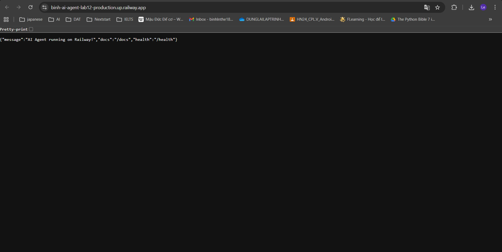

## Part 4: API Security

### Exercise 4.1-4.3: Test results
- 4.1: 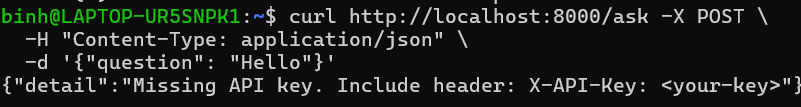
- 4.1: 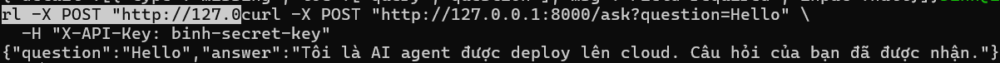
- 4.2: 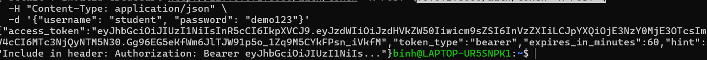
- 4.2: 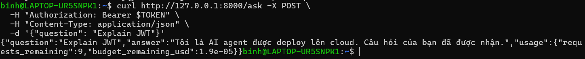
- 4.3: 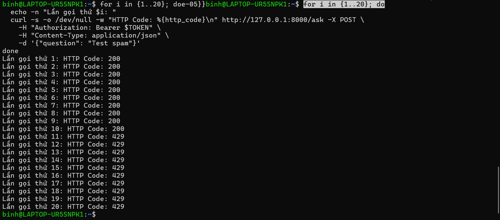

### Exercise 4.4: Cost guard implementation
```
def check_budget(user_id: str, estimated_cost: float) -> bool:
    """
    Logic:
    1. Mỗi user có hạn mức chi tiêu cố định (ví dụ $10).
    2. Sử dụng Redis để lưu trữ số tiền đã dùng: key = f"usage:{user_id}".
    """
    # Lấy số tiền đã tiêu từ Redis
    current_spent = float(redis_client.get(f"usage:{user_id}") or 0)
    
    # Kiểm tra nếu vượt quá hạn mức $10
    if current_spent + estimated_cost > 10.0:
        return False  # Chặn yêu cầu (trả về 402 hoặc 403)
        
    # Nếu hợp lệ, cập nhật số tiền mới vào Redis
    redis_client.set(f"usage:{user_id}", current_spent + estimated_cost)
    return True
```


## Part 5: Scaling & Reliability

### Exercise 5.1-5.5: Implementation notes
[Your explanations and test results]

- 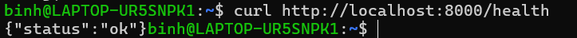
- 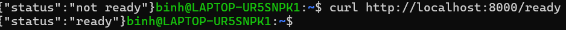
- 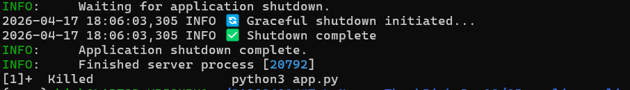
- 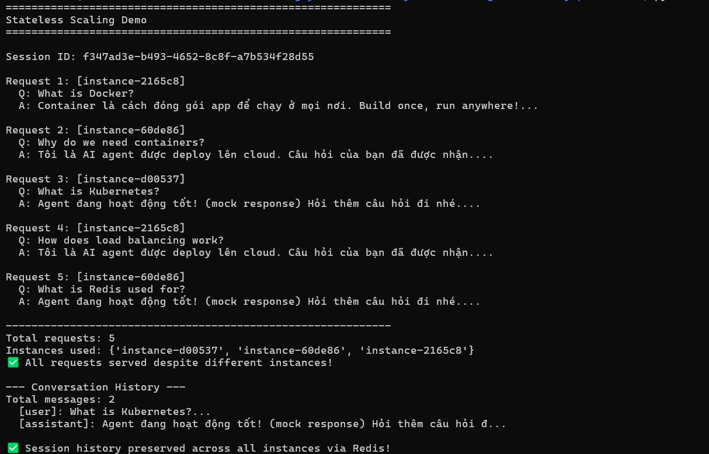
- 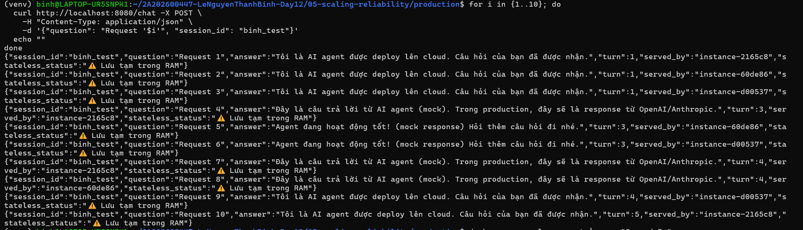

- 5.1: Mục tiêu: Giúp hệ thống tự động kiểm tra sức khỏe của Agent.
- 5.2: Mục tiêu: Tắt ứng dụng một cách "lịch sự", không gây mất dữ liệu đột ngột.
- 5.3: Mục tiêu: Biến Agent thành thực thể "không trí nhớ" để có thể mở rộng hàng ngang.
- 5.4: Mục tiêu: Phân phối tải trọng và tăng tính sẵn sàng (High Availability).
- 5.5: Mục tiêu: Kiểm chứng thực tế kiến trúc đã thiết kế.


### 2. Full Source Code - Lab 06 Complete (60 points)

Your final production-ready agent with all files:

```
your-repo/
├── app/
│   ├── main.py              # Main application
│   ├── config.py            # Configuration
│   ├── auth.py              # Authentication
│   ├── rate_limiter.py      # Rate limiting
│   └── cost_guard.py        # Cost protection
├── utils/
│   └── mock_llm.py          # Mock LLM (provided)
├── Dockerfile               # Multi-stage build
├── docker-compose.yml       # Full stack
├── requirements.txt         # Dependencies
├── .env.example             # Environment template
├── .dockerignore            # Docker ignore
├── railway.toml             # Railway config (or render.yaml)
└── README.md                # Setup instructions
```

**Requirements:**
-  All code runs without errors
-  Multi-stage Dockerfile (image < 500 MB)
-  API key authentication
-  Rate limiting (10 req/min)
-  Cost guard ($10/month)
-  Health + readiness checks
-  Graceful shutdown
-  Stateless design (Redis)
-  No hardcoded secrets

---

### 3. Service Domain Link

Create a file `DEPLOYMENT.md` with your deployed service information:


# Deployment Information

## Public URL
https://agent-service-production-06f7.up.railway.app

## Platform
Railway 

## Test Commands

### Health Check

curl https://your-agent.railway.app/health

- 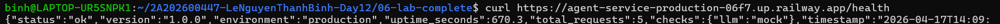
# Expected: {"status": "ok"}


### API Test (with authentication)
```bash
curl -X POST https://agent-service-production-06f7.up.railway.app/ask \
  -H "X-API-Key: my-secret-key" \
  -H "Content-Type: application/json" \
  -d '{"user_id": "test", "question": "Hello"}'
```

- 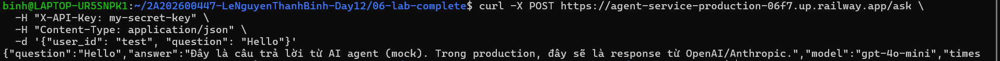

## Environment Variables Set
- PORT
- REDIS_URL
- AGENT_API_KEY
- LOG_LEVEL

- 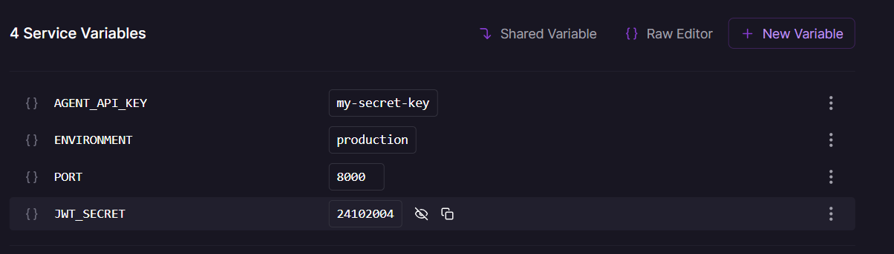
- 
## Screenshots
- [Deployment dashboard](screenshots/dashboard.png)
- 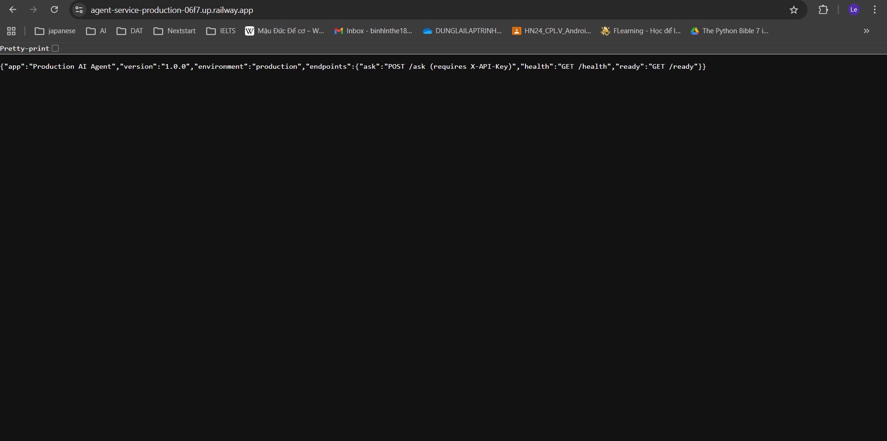
- [Service running](screenshots/running.png)
- 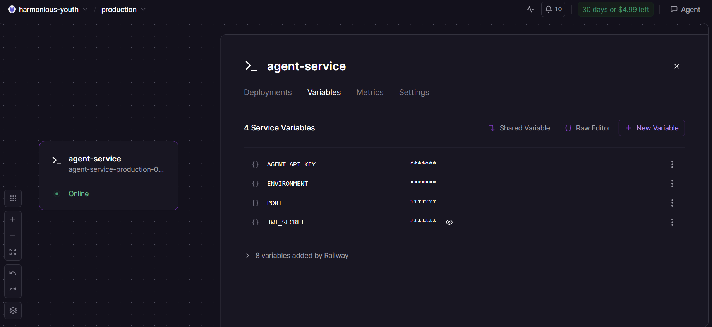
- [Test results](screenshots/test.png)
- 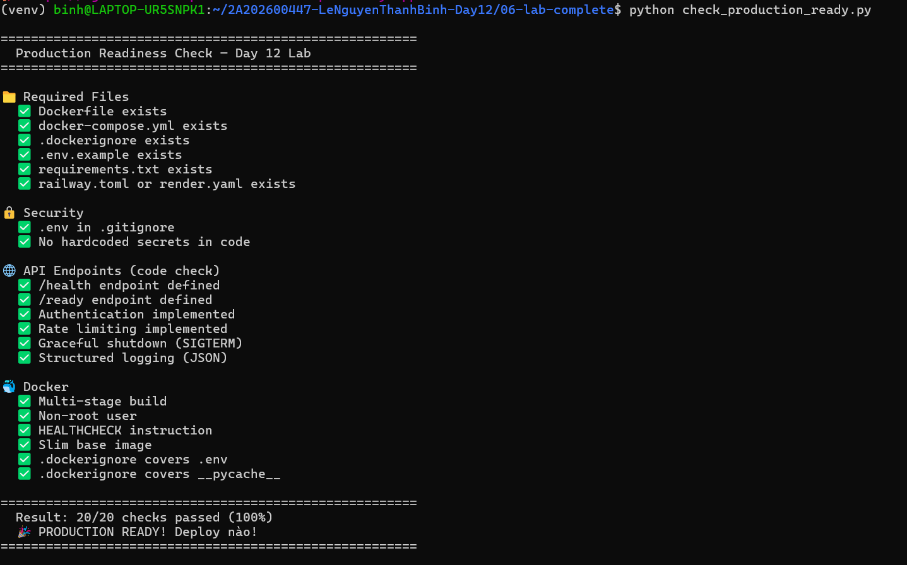
- 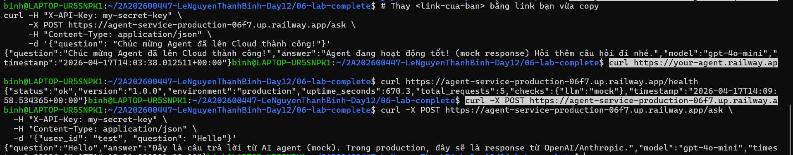
```

##  Pre-Submission Checklist

- [ ] Repository is public (or instructor has access)
- [ ] `MISSION_ANSWERS.md` completed with all exercises
- [ ] `DEPLOYMENT.md` has working public URL
- [ ] All source code in `app/` directory
- [ ] `README.md` has clear setup instructions
- [ ] No `.env` file committed (only `.env.example`)
- [ ] No hardcoded secrets in code
- [ ] Public URL is accessible and working
- [ ] Screenshots included in `screenshots/` folder
- [ ] Repository has clear commit history

---

##  Self-Test

Before submitting, verify your deployment:

```bash
# 1. Health check
curl https://your-app.railway.app/health

# 2. Authentication required
curl https://your-app.railway.app/ask
# Should return 401

# 3. With API key works
curl -H "X-API-Key: YOUR_KEY" https://your-app.railway.app/ask \
  -X POST -d '{"user_id":"test","question":"Hello"}'
# Should return 200

# 4. Rate limiting
for i in {1..15}; do 
  curl -H "X-API-Key: YOUR_KEY" https://your-app.railway.app/ask \
    -X POST -d '{"user_id":"test","question":"test"}'; 
done
# Should eventually return 429
```

---

##  Submission

**Submit your GitHub repository URL:**

```
https://github.com/your-username/day12-agent-deployment
```

**Deadline:** 17/4/2026

---

##  Quick Tips

1.  Test your public URL from a different device
2.  Make sure repository is public or instructor has access
3.  Include screenshots of working deployment
4.  Write clear commit messages
5.  Test all commands in DEPLOYMENT.md work
6.  No secrets in code or commit history

---

##  Need Help?

- Check [TROUBLESHOOTING.md](TROUBLESHOOTING.md)
- Review [CODE_LAB.md](CODE_LAB.md)
- Ask in office hours
- Post in discussion forum

---

**Good luck! **
